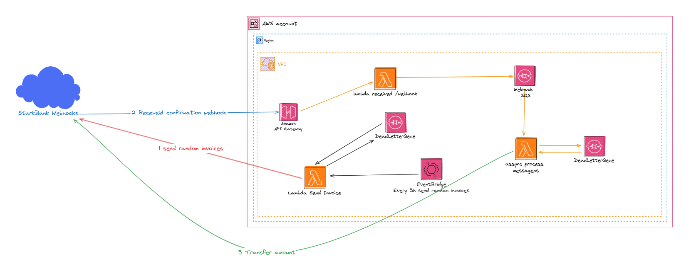
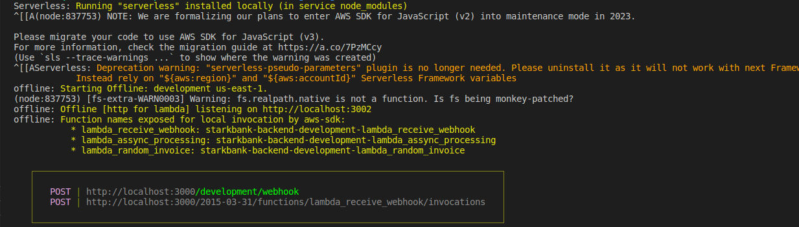
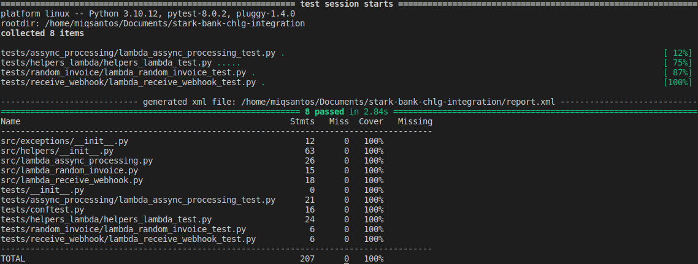

# About

This project is a serverless application that integrates with startkbank webhook. Basically, it listens to a webhook and sends the data to a lambda function that will process the data and send it a transfer to another startbank's account, if the payment was confirmed from invoices.

## Technologies
- [Serverless Framework](https://www.serverless.com/)
- [Python](https://www.python.org/)
- [AWS Lambda](https://aws.amazon.com/lambda/)
- [AWS API Gateway](https://aws.amazon.com/api-gateway/)
- [AWS CloudWatch](https://aws.amazon.com/cloudwatch/)
- [AWS SNS](https://aws.amazon.com/sns/)
- [AWS SQS](https://aws.amazon.com/sqs/)
- [AWS IAM](https://aws.amazon.com/iam/)
- [AWS X-Ray](https://aws.amazon.com/xray/)
- [AWS EventBridge](https://aws.amazon.com/eventbridge/)
- [AWS Secrets Manager](https://aws.amazon.com/secrets-manager/)
- [AWS CloudFormation](https://aws.amazon.com/cloudformation/)
- [StarkBanK SDK](https://github.com/starkbank/sdk-python?tab=readme-ov-file#process-webhook-events)

## Architecture

All the functions created in this project was thinking in fault tolerance, scalability and assync process. The project is divided into 3 main functions:

1. Issues 8 to 12 Invoices every 3 hours to random people for 24 hours invoices requests to starkbank API
2. Starkbank API sends a webhook callback of the Invoice credit
3. sends the received amount to the following account using a Transfer API


##  Installation -> install all the requirements below and package.json:
* [Python](https://www.python.org/downloads) >= 3.8.10
* [Serverless Framework](https://www.serverless.com/framework/docs/getting-started/) v2.72.4 (I used this version)
* [AWS CLI](https://aws.amazon.com/cli/)
* [Docker](https://www.docker.com/products/docker-desktop)
* [Node.js](https://nodejs.org/en/download/) v12.22.9 (I used this version)

## Create a virtual enviroment to install depencies:
```
python -m venv .venv
./.venv/Scripts/activate
```
## Installing dependencies:
```
python -m pip install -r requirements.txt && npm install
```

## Access the project folder ###
```
 sls offline start
```


## Test
```
coverage run -m pytest tests --junit-xml=report.xml && coverage report -m
```
